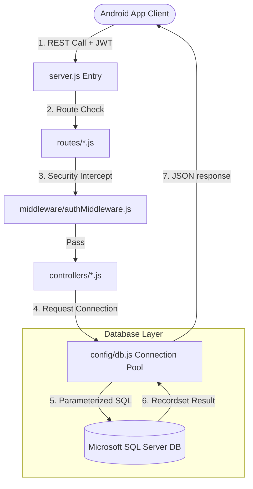
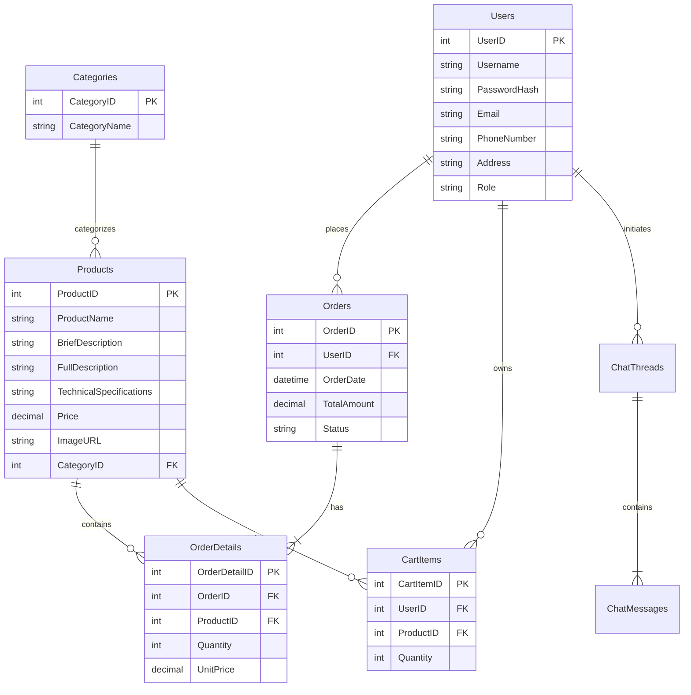
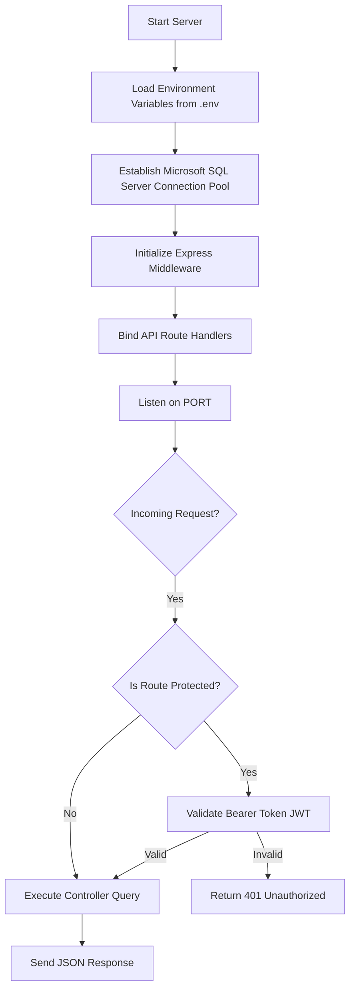
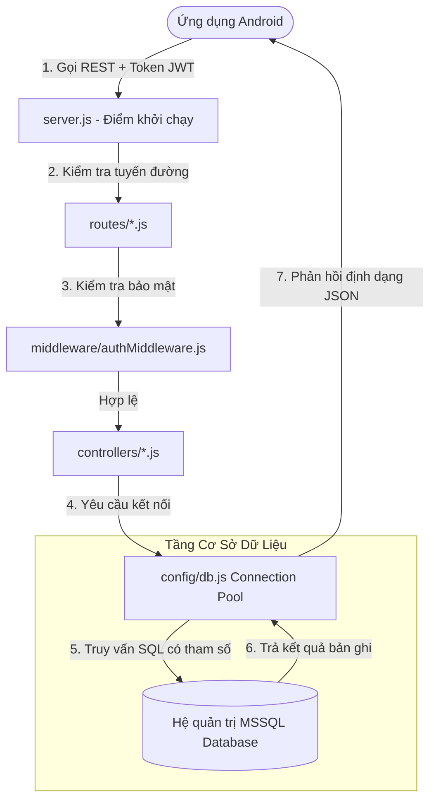
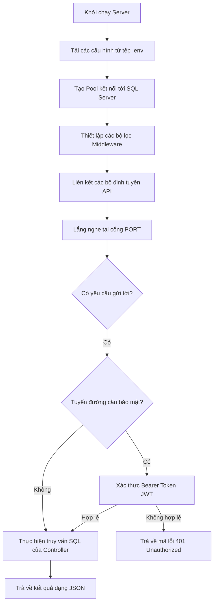

#  PRM392: SalesAPP Backend Service

<div align="center">

  
  
  
  

  **A secure, high-performance RESTful API backend built with Express.js and Microsoft SQL Server to power the SalesAPP mobile e-commerce client.**

  [ Phiên Bản Tiếng Việt](#phiên-bản-tiếng-việt) | [ English Version](#english-version)

</div>

---

#  English Version

## 1. Project Title
<div align="center">
  <h2>💻 PRM392 SalesAPP Backend — Express.js & Microsoft SQL Server REST API Engine</h2>
</div>

---

## 2. Project Overview
**PRM392_SalesAPP_BE** is the server-side API application designed to support the **PRM392_SalesAPP_Android** mobile app. Built with Node.js and Express.js, it manages secure data operations and connects to a Microsoft SQL Server database using connection pooling.

The backend exposes a suite of JSON endpoints handling:
*   **Identity Management:** Implements JWT-secured session paths and hashed password storage using `bcryptjs`.
*   **Operational Workflows:** Handles shopping cart synchronization, product listing lookups, catalog sorting/filtering, and order placement.
*   **Communication Channels:** Manages message-thread support chat histories.
*   **Store Locations:** Exposes geographic details for brick-and-mortar retail outlets.

---

## 3. Executive Summary
The SalesAPP Backend leverages Express routing and middleware architectures to provide the mobile client with a reliable API. The service connects to a local or remote SQL Server instance using the `mssql` and `msnodesqlv8` native drivers.

> [!WARNING]
> Since configuration parameters (like `.env`) and database handlers (`config/db.js`) contain localized system settings, they are excluded from the repository. This documentation provides copy-pasteable templates for these files.

---

## 4. Key Features
*   **🔐 Secure Credentials Hashing:** Uses `bcryptjs` for salting and hashing user passwords before database storage.
*   **🎟️ JWT-Based Authorization:** Restricts access to cart management, profile updates, and order placement to authenticated users.
*   **🛡️ SQL Injection Prevention:** Uses parameterized queries via the `mssql` connection pool to sanitize user inputs.
*   **📊 Multi-Criteria Catalog Filtering:** Handles database queries containing price boundaries, categories, and sorting options.
*   **💬 Chat Thread Archival:** Stores support chat histories between customers and support accounts.
*   **🗺️ Store Locator API:** Exposes geographic coordinates and outlet information for integration with the Google Maps SDK.

---

## 5. User Roles
The backend defines access levels for three user roles:

| Role Name | Description | Access Scope |
| :--- | :--- | :--- |
| **👤 Customer (Mobile Client)** | End-user browsing products. | Read-only access to products and locations; read-write access to their own cart, profile, and chat threads. |
| **🛠️ Support Staff** | Store representative. | Read-write access to chat support threads to respond to customer inquiries. |
| **🎓 Evaluator / Admin** | Grader or system administrator. | Complete read-write access to the database, including the ability to add new products or clear ratings. |

---

## 6. Use Cases
1.  **Synchronizing Cart Items:** The mobile client logs in, receives a JWT, and requests `/api/cart`. The backend queries the `CartItems` table, joins the `Products` table, and returns a JSON payload containing active cart items.
2.  **Placing an Order:** During checkout, the client posts order details to `/api/orders`. The backend initiates a transaction, inserts a record into the `Orders` table, generates `OrderDetail` entries for each item, and clears the user's cart.
3.  **Support Chat:** A customer sends a message. The backend saves the entry to `ChatMessages` under the corresponding `ChatThread` ID, allowing support representatives to view and respond to the query.

---

## 7. System Architecture
The backend is structured as a layered MVC REST API:



---

## 8. Technology Stack
*   **Application Platform:** Node.js (v18.x / v20.x).
*   **Web Framework:** Express.js (v5.1.0).
*   **Database Engine:** Microsoft SQL Server (LocalDB or Azure SQL).
*   **DB Connectors:** `mssql` & `msnodesqlv8` (for Windows Authentication support).
*   **Security Libraries:** `bcryptjs` (password encryption), `jsonwebtoken` (session signing).

---

## 9. Project Structure
```text
PRM392_SalesAPP_BE/
├── config/                    # Configuration files (Git-ignored)
│   └── db.js                  # Database connection pool setup
├── controllers/               # Business logic controllers
│   ├── authController.js      # Register, Login, and Profile updates
│   ├── cartController.js      # Cart CRUD actions
│   ├── chatController.js      # Support chat message handlers
│   ├── locationController.js  # Shop location coordinates manager
│   ├── orderController.js     # Transactional order creators
│   └── productController.js   # Product querying, sorting & creation
├── middleware/                # Express middleware
│   └── authMiddleware.js      # JWT validator & role guards
├── routes/                    # API Route definitions
│   ├── authRoutes.js
│   ├── cartRoutes.js
│   ├── chatRoutes.js
│   ├── locationRoutes.js
│   ├── orderRoutes.js
│   └── productRoutes.js
├── .env                       # Environment variables (Git-ignored)
├── package.json               # Dependencies and scripts manifest
└── server.js                  # Application entry point
```

---

## 10. Core Business Logic
*   **Secure Connection Pooling:** Queries reuse connection instances rather than opening new connections for each request:
    ```javascript
    const pool = await poolPromise;
    const result = await pool.request()
      .input('category', sql.NVarChar, category)
      .query('SELECT * FROM Products WHERE Category = @category');
    ```
*   **Atomic Order Transactions:** Orders must commit both the main order record and all associated line items, or roll back entirely in case of failure.

---

## 11. Database Design
The SQL database contains the following table structures:



---

## 12. API Documentation

### 🔑 Auth API (`/api/auth`)
*   `POST /signup` - Registers a new user. Expects `username`, `password`, `email`, `role`.
*   `POST /login` - Validates credentials and returns a JWT.
*   `GET /profile` - Fetches authenticated user profile details.
*   `PUT /profile` - Updates user contact information.

### 🛒 Cart API (`/api/cart`)
*   `GET /` - Fetches active cart items.
*   `POST /items` - Appends products to the cart.
*   `PUT /items/:itemId` - Updates cart item quantities.
*   `DELETE /items/:itemId` - Removes an item from the cart.

### 📦 Orders API (`/api/orders`)
*   `POST /` - Places a new order and clears the cart.
*   `GET /history` - Retrieves order history.
*   `GET /:id` - Fetches detailed line items for a specific order.

---

## 13. Authentication & Authorization
*   **JWT Token Guard:** Routes are protected by verification checks inside `middleware/authMiddleware.js`.
*   **Role Restriction:** Admin-only routes (e.g. adding new products) are protected using the `admin` middleware check:
    ```javascript
    const admin = (req, res, next) => {
      if (req.user && req.user.role === 'admin') next();
      else res.status(403).json({ message: 'Not authorized as an admin' });
    };
    ```

---

## 14. Application Workflow


---

## 15. Installation Guide

### Prerequisites
*   **Node.js:** v18.x or v20.x installed.
*   **Database:** Microsoft SQL Server (LocalDB, Express Edition, or Developer Edition).

### Step-by-Step Setup
1.  **Clone the Repository:**
    ```bash
    git clone https://github.com/nmbt2910/PRM392_SalesAPP_BE.git
    cd PRM392_SalesAPP_BE
    ```
2.  **Install NPM packages:**
    ```bash
    npm install
    ```
3.  **Configure local Environment settings:**
    Create a `.env` file in the root directory:
    ```ini
    PORT=3000
    JWT_SECRET=your_super_secret_jwt_key
    DB_USER=your_sql_server_username
    DB_PASSWORD=your_sql_server_password
    DB_SERVER=localhost
    DB_DATABASE=SalesAppDB
    DB_TRUST_SERVER_CERT=true
    DB_ENCRYPT=false
    ```
4.  **Create the Database Config Script:**
    Create a folder named `config` in the root directory, and save this file inside as `config/db.js`:
    ```javascript
    const sql = require('mssql');

    const config = {
        user: process.env.DB_USER,
        password: process.env.DB_PASSWORD,
        server: process.env.DB_SERVER,
        database: process.env.DB_DATABASE,
        options: {
            encrypt: process.env.DB_ENCRYPT === 'true',
            trustServerCertificate: process.env.DB_TRUST_SERVER_CERT === 'true'
        }
    };

    const poolPromise = new sql.ConnectionPool(config)
        .connect()
        .then(pool => {
            console.log('Connected to Microsoft SQL Server Connection Pool');
            return pool;
        })
        .catch(err => {
            console.error('Database connection failed: ', err);
            throw err;
        });

    const connectDB = async () => {
        try {
            await poolPromise;
        } catch (err) {
            console.error('Failed to initialize database connection: ', err);
            process.exit(1);
        }
    };

    module.exports = {
        sql,
        poolPromise,
        connectDB
    };
    ```
5.  **Run Database Migrations:**
    Execute your SQL creation scripts in SQL Server Management Studio (SSMS) to initialize the tables (`Users`, `Products`, `Categories`, `CartItems`, `Orders`, `OrderDetails`, `ChatThreads`, `ChatMessages`, `StoreLocations`).
6.  **Start Development API Server:**
    ```bash
    npm run dev
    ```

---

## 16. Configuration
*   `nodemon.json`: Configures file extensions monitored for hot reloads.
*   `.env`: Configures port settings, database credentials, encryption parameters, and JWT secret keys.

---

## 17. Development Guide
*   **Controller Design:** Keep route files clean by isolating query execution logic inside the `controllers` folder.
*   **Database Best Practices:** Always use parameterized inputs (`.input('param', sql.Type, value)`) when executing queries to prevent SQL injections.
*   **Response Standards:** Return descriptive HTTP status codes: `200` for success, `201` for resource creation, `400` for validation issues, `401` for authorization issues, and `500` for system failures.

---

## 18. Future Enhancements
*   **🔗 VNPay Instant Payment Notification (IPN):** Implement secure callback handlers to capture digital transaction updates.
*   **🚀 API Documentation:** Integrate Swagger UI to provide interactive API documentation.
*   **⚡ Redis Cache integration:** Cache static catalog queries using Redis to reduce database read overhead.

---

## 19. Known Limitations
*   **Database Setup:** The application does not include automated database migration tools. Tables must be created manually before launch.
*   **JWT Revocation:** The system uses stateless JWT sessions. Session tokens cannot be revoked before their expiration time.

---

## 20. Conclusion
The PRM392 SalesAPP Backend provides a secure, organized API server to support mobile e-commerce workflows. By separating database operations from the mobile presentation layer, it ensures a clean architecture for student projects.

---

# 🇻🇳 Phiên Bản Tiếng Việt

## 1. Tiêu Đề Dự Án
<div align="center">
  <h2>💻 PRM392 SalesAPP Backend — Hệ Thống API RESTful Node.js & Microsoft SQL Server</h2>
</div>

---

## 2. Tổng Quan Dự Án
**PRM392_SalesAPP_BE** là máy chủ dịch vụ API đóng vai trò xử lý nghiệp vụ phía sau cho ứng dụng di động mua sắm **PRM392_SalesAPP_Android**. Được xây dựng trên nền tảng Node.js kết hợp Express.js, dự án quản lý các luồng thao tác dữ liệu và kết nối đến cơ sở dữ liệu Microsoft SQL Server.

Hệ thống cung cấp các cổng API trả về định dạng dữ liệu JSON phục vụ các tính năng:
*   **Quản Lý Tài Khoản:** Đăng ký, đăng nhập bảo mật bằng chữ ký số JWT và mã hóa mật khẩu qua thư viện `bcryptjs`.
*   **Nghiệp Vụ Bán Hàng:** Đồng bộ hóa giỏ hàng của người dùng, tìm kiếm sản phẩm, lọc/sắp xếp danh mục và xử lý giao dịch đặt hàng.
*   **Kênh Hội Thoại:** Lưu trữ lịch sử tin nhắn trò chuyện giữa khách hàng và bộ phận hỗ trợ.
*   **Đại Lý Cửa Hàng:** Cung cấp thông tin địa chỉ tọa độ định vị hệ thống cửa hàng.

---

## 3. Báo Cáo Tóm Tắt (Executive Summary)
SalesAPP Backend tận dụng cơ chế định tuyến và các lớp kiểm soát (middleware) của Express để cung cấp bộ dịch vụ API tin cậy cho ứng dụng Android. Máy chủ kết nối đến cơ sở dữ liệu SQL Server thông qua các trình điều khiển mssql kết hợp msnodesqlv8.

> [!WARNING]
> Do các tệp tin cấu hình môi trường hệ thống (`.env`) và kết nối cơ sở dữ liệu (`config/db.js`) chứa thông tin cấu hình nội bộ, chúng được cấu hình bỏ qua trong Git. Hướng dẫn này cung cấp sẵn các mẫu mã nguồn để bạn tự cấu hình trên máy cá nhân.

---

## 4. Các Tính Năng Cốt Lõi
*   **🔐 Mã Hóa Mật Khẩu:** Sử dụng thuật toán băm `bcryptjs` để bảo mật thông tin mật khẩu của người dùng trước khi ghi nhận vào cơ sở dữ liệu.
*   **🎟️ Xác Thực Chữ Ký Số JWT:** Ràng buộc quyền truy cập các API thêm giỏ hàng, cập nhật thông tin cá nhân và tạo đơn đặt hàng.
*   **🛡️ Ngăn Chặn SQL Injection:** Sử dụng cơ chế truyền tham số an toàn (parameterized queries) thông qua pool kết nối của `mssql`.
*   **📊 Lọc Danh Mục Nâng Cao:** Hỗ trợ truy vấn sản phẩm kèm điều kiện khoảng giá, phân nhóm danh mục và sắp xếp tăng/giảm.
*   **💬 Lưu Trữ Tin Nhắn Chat:** Quản lý các luồng tin nhắn trao đổi hỗ trợ trực tuyến giữa tài khoản khách hàng và nhân viên.
*   **🗺️ Cung Cấp Tọa Độ Đại Lý:** Trả về tọa độ kinh độ và vĩ độ của hệ thống cửa hàng để tích hợp hiển thị trên Google Maps SDK.

---

## 5. Các Vai Trò Người Dùng
Hệ thống phân quyền truy cập API cho ba nhóm đối tượng:

| Tên Vai Trò | Mô tả | Quyền hạn truy cập |
| :--- | :--- | :--- |
| **👤 Khách Hàng (App Mobile)** | Người dùng mua sắm. | Chỉ đọc danh mục sản phẩm và bản đồ; được quyền thêm, sửa, xóa giỏ hàng, cập nhật thông tin và nhắn tin hỗ trợ của riêng mình. |
| **🛠️ Nhân Viên Hỗ Trợ** | Tài khoản chăm sóc khách hàng. | Có quyền đọc và trả lời các tin nhắn hỗ trợ của khách hàng gửi tới hệ thống. |
| **🎓 Quản Trị Viên (Admin)** | Người chấm điểm hoặc quản trị viên. | Toàn quyền kiểm soát cơ sở dữ liệu, quản lý danh mục sản phẩm và dọn dẹp hệ thống. |

---

## 6. Kịch Bản Sử Dụng (Use Cases)
1.  **Đồng Bộ Giỏ Hàng:** Người dùng đăng nhập thành công, nhận token JWT và gửi yêu cầu đến `/api/cart`. API truy vấn bảng `CartItems` kết hợp bảng `Products` và trả về danh sách sản phẩm đang có trong giỏ hàng.
2.  **Đặt Hàng Giao Dịch:** Tại bước thanh toán, ứng dụng Android gửi thông tin đơn hàng đến `/api/orders`. Máy chủ thực hiện giao dịch ghi nhận đơn hàng mới vào bảng `Orders`, tạo các chi tiết đơn hàng trong `OrderDetails` và làm sạch giỏ hàng.
3.  **Nhận Phản Hồi Trực Tuyến:** Khách hàng gửi tin nhắn. API ghi nhận nội dung vào bảng `ChatMessages` liên kết với mã phòng chat `ChatThread`, giúp nhân viên chăm sóc khách hàng đọc và trả lời phản hồi.

---

## 7. Kiến Trúc Hệ Thống
Hệ thống được thiết kế theo cấu trúc phân tầng MVC REST API:



---

## 8. Công Nghệ Sử Dụng
*   **Nền tảng thực thi:** Node.js (Phiên bản v18.x hoặc v20.x trở lên).
*   **Khung ứng dụng web:** Express.js (Phiên bản v5.1.0).
*   **Hệ quản trị cơ sở dữ liệu:** Microsoft SQL Server.
*   **Trình điều khiển cơ sở dữ liệu:** Thư viện `mssql` và `msnodesqlv8` (Hỗ trợ xác thực Windows Authentication).
*   **Thư viện bảo mật:** `bcryptjs` (Mã hóa mật khẩu), `jsonwebtoken` (Xử lý chữ ký số phiên đăng nhập).

---

## 9. Cấu Trúc Thư Mục Dự Án
```text
PRM392_SalesAPP_BE/
├── config/                    # Thư mục cấu hình (Git-ignored)
│   └── db.js                  # Khởi tạo kết nối Microsoft SQL Server
├── controllers/               # Các tệp điều hướng và xử lý logic nghiệp vụ
│   ├── authController.js      # Đăng ký, đăng nhập và hồ sơ cá nhân
│   ├── cartController.js      # Các API thêm sửa xóa giỏ hàng
│   ├── chatController.js      # Quản lý tin nhắn trò chuyện hỗ trợ
│   ├── locationController.js  # Lấy dữ liệu danh sách đại lý cửa hàng
│   ├── orderController.js     # Thao tác giao dịch đặt hàng thành công
│   └── productController.js   # Tìm kiếm, lọc và phân loại sản phẩm
├── middleware/                # Các bộ lọc kiểm soát
│   └── authMiddleware.js      # Xác thực token JWT và phân quyền Admin
├── routes/                    # Định nghĩa tuyến đường các API
│   ├── authRoutes.js
│   ├── cartRoutes.js
│   ├── chatRoutes.js
│   ├── locationRoutes.js
│   ├── orderRoutes.js
│   └── productRoutes.js
├── .env                       # Tệp cấu hình môi trường (Git-ignored)
├── package.json               # Khai báo các thư viện phụ thuộc và lệnh chạy
└── server.js                  # Điểm khởi động máy chủ chính
```

---

## 10. Logic Nghiệp Vụ Cốt Lõi
*   **Tái Sử Dụng Kết Nối (Connection Pooling):** Các yêu cầu truy vấn sử dụng chung kết nối có sẵn giúp tăng tốc độ phản hồi:
    ```javascript
    const pool = await poolPromise;
    const result = await pool.request()
      .input('category', sql.NVarChar, category)
      .query('SELECT * FROM Products WHERE Category = @category');
    ```
*   **Giao Dịch Đặt Hàng Đồng Nhất:** Đảm bảo toàn bộ các chi tiết sản phẩm của đơn hàng được lưu thành công vào bảng `OrderDetails`, nếu có bất kỳ lỗi nào xảy ra hệ thống sẽ hủy bỏ (rollback) toàn bộ tiến trình để tránh sai lệch dữ liệu.

---

## 11. Thiết Kế Cơ Cơ Dữ Liệu
Hệ thống sử dụng cơ sở dữ liệu quan hệ SQL Server bao gồm các thực thể:


---

## 12. Tài Liệu API

### 🔑 API Xác Thực Tài Khoản (`/api/auth`)
*   `POST /signup` - Đăng ký tài khoản mới. Yêu cầu `username`, `password`, `email`, `role`.
*   `POST /login` - Đăng nhập tài khoản và nhận mã JWT.
*   `GET /profile` - Lấy thông tin tài khoản người chơi đang đăng nhập.
*   `PUT /profile` - Chỉnh sửa thông tin liên hệ và nhận hàng.

### 🛒 API Giỏ Hàng (`/api/cart`)
*   `GET /` - Lấy thông tin sản phẩm trong giỏ hàng hiện tại.
*   `POST /items` - Thêm sản phẩm vào giỏ hàng.
*   `PUT /items/:itemId` - Thay đổi số lượng sản phẩm.
*   `DELETE /items/:itemId` - Xóa sản phẩm khỏi giỏ hàng.

### 📦 API Đơn Hàng (`/api/orders`)
*   `POST /` - Tạo đơn hàng thanh toán mới và dọn sạch giỏ hàng.
*   `GET /history` - Xem danh sách đơn hàng đã mua.
*   `GET /:id` - Xem chi tiết danh sách sản phẩm trong hóa đơn cụ thể.

---

## 13. Xác Thực Và Phân Quyền
*   **Kiểm Soát Token:** Tuyến đường được bảo vệ bởi tệp kiểm duyệt `middleware/authMiddleware.js`.
*   **Phân Quyền Admin:** Các chức năng quản trị như thêm sản phẩm được bảo mật bằng điều kiện kiểm tra vai trò người dùng:
    ```javascript
    const admin = (req, res, next) => {
      if (req.user && req.user.role === 'admin') next();
      else res.status(403).json({ message: 'Không có quyền truy cập quản trị' });
    };
    ```

---

## 14. Luồng Hoạt Động Ứng Dụng


---

## 15. Hướng Dẫn Cài Đặt

### Yêu Cầu Cài Đặt
*   **Node.js:** Đã cài đặt phiên bản v18.x hoặc v20.x trở lên.
*   **Cơ sở dữ liệu:** Microsoft SQL Server đã được cài đặt cục bộ hoặc Azure SQL Server.

### Các Bước Thực Hiện
1.  **Tải Mã Nguồn:**
    ```bash
    git clone https://github.com/nmbt2910/PRM392_SalesAPP_BE.git
    cd PRM392_SalesAPP_BE
    ```
2.  **Cài Đặt Thư Viện:**
    ```bash
    npm install
    ```
3.  **Cấu Hình Tham Số Môi Trường:**
    Tạo tệp `.env` tại thư mục gốc của dự án:
    ```ini
    PORT=3000
    JWT_SECRET=mã_khóa_bí_mật_chữ_ký_số_của_bạn
    DB_USER=tên_đăng_nhập_sql_server
    DB_PASSWORD=mật_khẩu_sql_server
    DB_SERVER=localhost
    DB_DATABASE=SalesAppDB
    DB_TRUST_SERVER_CERT=true
    DB_ENCRYPT=false
    ```
4.  **Tạo Tệp Tin Kết Nối Cơ Sở Dữ Liệu:**
    Tạo một thư mục mới tên là `config` ở thư mục gốc của dự án, sau đó tạo tệp tin `db.js` bên trong thư mục đó với nội dung sau:
    ```javascript
    const sql = require('mssql');

    const config = {
        user: process.env.DB_USER,
        password: process.env.DB_PASSWORD,
        server: process.env.DB_SERVER,
        database: process.env.DB_DATABASE,
        options: {
            encrypt: process.env.DB_ENCRYPT === 'true',
            trustServerCertificate: process.env.DB_TRUST_SERVER_CERT === 'true'
        }
    };

    const poolPromise = new sql.ConnectionPool(config)
        .connect()
        .then(pool => {
            console.log('Kết nối thành công với Microsoft SQL Server');
            return pool;
        })
        .catch(err => {
            console.error('Kết nối cơ sở dữ liệu thất bại: ', err);
            throw err;
        });

    const connectDB = async () => {
        try {
            await poolPromise;
        } catch (err) {
            console.error('Không thể khởi tạo kết nối cơ sở dữ liệu: ', err);
            process.exit(1);
        }
    };

    module.exports = {
        sql,
        poolPromise,
        connectDB
    };
    ```
5.  **Tạo Cấu Trúc Bảng Lịch Sử:**
    Sử dụng SQL Server Management Studio (SSMS) để chạy các câu lệnh tạo bảng (`Users`, `Products`, `Categories`, `CartItems`, `Orders`, `OrderDetails`, `ChatThreads`, `ChatMessages`, `StoreLocations`) trước khi khởi chạy ứng dụng.
6.  **Khởi Chạy Máy Chủ API:**
    ```bash
    npm run dev
    ```

---

## 16. Cấu Hình
*   `nodemon.json`: Thiết lập danh sách các định dạng tệp tin lắng nghe để tự động khởi động lại khi có thay đổi.
*   `.env`: Quản lý các biến môi trường nhạy cảm như cổng chạy, mật khẩu cơ sở dữ liệu và chữ ký bí mật của token JWT.

---

## 17. Hướng Dẫn Phát Triển
*   **Quy Quy Chuẩn Code:** Đảm bảo viết các đoạn truy vấn SQL trong thư mục `controllers`, tách biệt hoàn toàn khỏi định tuyến tuyến đường tại thư mục `routes`.
*   **Bảo Mật Truy Vấn:** Luôn luôn truyền tham số dạng biến đầu vào (`.input('name', sql.Type, value)`) để tránh lỗi bảo mật SQL Injection.
*   **Chuẩn Phản Hồi:** Trả về các trạng thái HTTP phù hợp (200: Thành công, 201: Đã tạo, 400: Dữ liệu không hợp lệ, 401: Không có quyền truy cập, 500: Lỗi máy chủ hệ thống).

---

## 18. Kế Hoạch Phát Triển Tương Lai
*   **🔗 Tích Hợp VNPay IPN Callback:** Thiết lập tuyến đường phản hồi tự động kiểm tra chữ ký kiểm soát hóa đơn từ hệ thống VNPay.
*   **🚀 API Documentation:** Nhúng giao diện Swagger UI để tương tác thử nghiệm trực quan các cổng API trực tuyến.
*   **⚡ Nâng Cao Hiệu Năng Với Redis:** Bộ nhớ đệm hỗ trợ lưu trữ danh mục sản phẩm tĩnh giúp tối ưu tốc độ đọc cơ sở dữ liệu.

---

## 19. Hạn Chế Hiện Tại
*   **Khởi Tạo Dữ Liệu:** Dự án chưa thiết lập các tệp lệnh migrations tự động. Bảng dữ liệu cần được tạo thủ công trước khi bắt đầu.
*   **Hủy Phiên JWT:** Token JWT được thiết kế dạng stateless và chưa hỗ trợ cơ chế thu hồi token trước thời điểm hết hạn.

---

## 20. Kết Luận
Máy chủ PRM392 SalesAPP Backend cung cấp giải pháp xử lý dữ liệu và logic nghiệp vụ an toàn và rõ ràng cho ứng dụng thương mại điện tử trên di động. Việc tách biệt cơ sở dữ liệu SQL Server sang tầng API RESTful giúp đảm bảo cấu trúc dự án phát triển di động bền vững và có khả năng mở rộng tốt.
